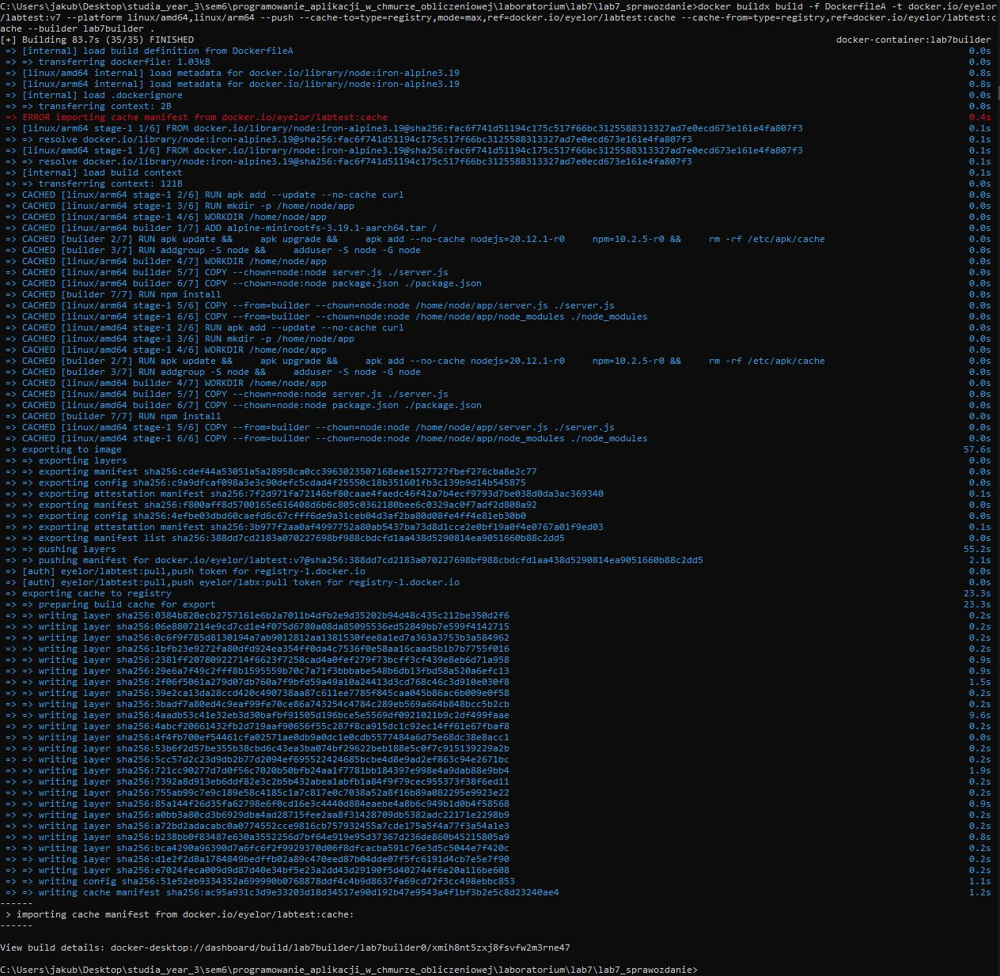
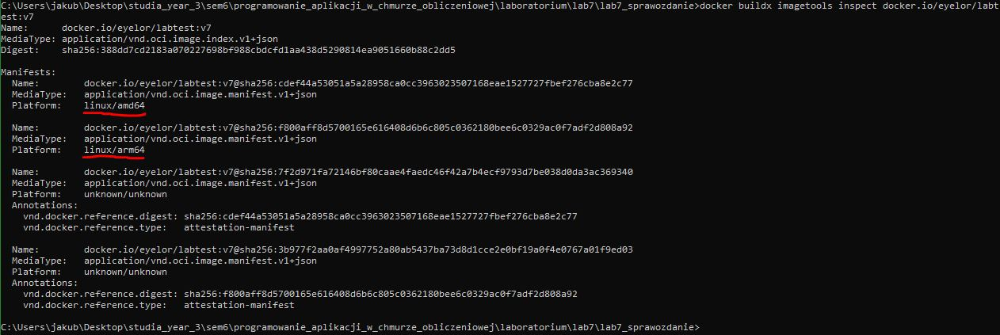
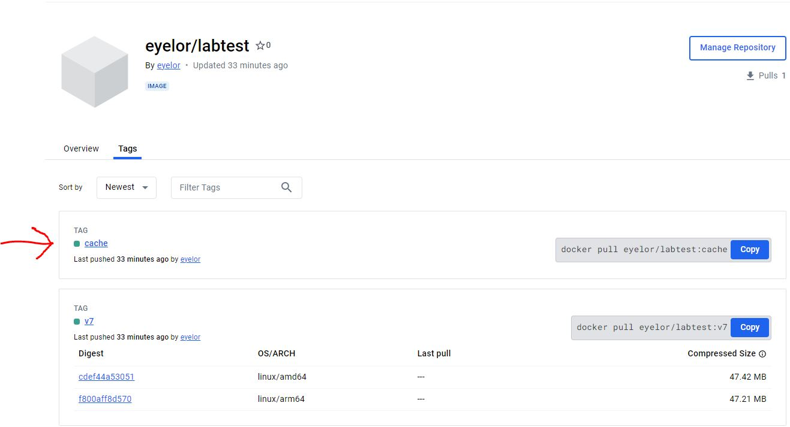
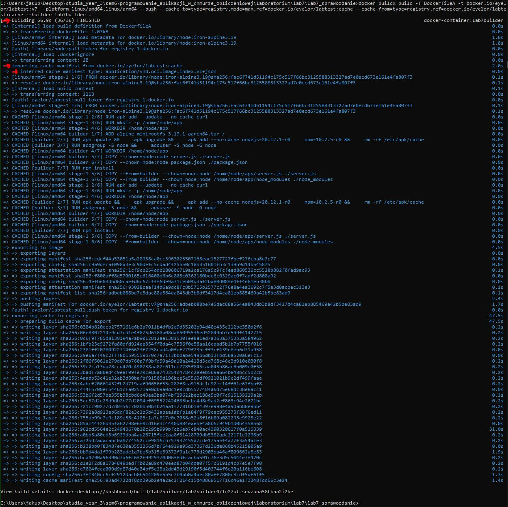

# docker-lab-7-buildx
This project showcases the usage of building images for various device architectures and managing cached data during the building process.

## Table of Contents

- [Requirements](#requirements)
- [Image Building](#image-building)
- [Multi-Platform Confirmation](#multi-platform-confirmation)
- [DockerHub Cache Data](#dockerhub-cache-data)
- [Cache Data From Registry Confirmation](#cache-data-from-registry-confirmation)

## Requirements

For Linux and Windows systems Docker or Docker Desktop must be installed and running.

For Windows systems WSL must be installed.

To create a builder:

```cmd
docker buildx create --name lab7builder --driver docker-container --bootstrap
```

To use the created builder:

```cmd
docker buildx use lab7builder
```

## Image Building

Example for Windows:

Run the command below to build an image. Change the '-t' parameter and the 'ref' value to match your account name on DockerHub.

```cmd
docker buildx build -f DockerfileA -t docker.io/eyelor/labtest:v7 --platform linux/amd64,linux/arm64 --push --cache-to=type=registry,mode=max,ref=docker.io/eyelor/labtest:cache --cache-from=type=registry,ref=docker.io/eyelor/labtest:cache --builder lab7builder .
```

Result:



The message "ERROR importing cache manifest from docker.io/eyelor/labtest:cache" indicates that this is the first build, and there is no 'cache' tag in the labtest repository yet.

## Multi-Platform Confirmation

Run the command below to check which platforms are compatible. Change the inspected repository to match your account name on DockerHub.

```cmd
docker buildx imagetools inspect docker.io/eyelor/labtest:v7
```

Result:



Platforms used are marked in red.

## DockerHub Cache Data

Open the repository to see if cache data is present under the cache tag.

Example of my repository:

Site: [https://hub.docker.com/r/eyelor/labtest/tags](https://hub.docker.com/r/eyelor/labtest/tags)

Result:



The cache tag is marked in red.

## Cache Data From Registry Confirmation

Run the command below to build the image again. Change the '-t' parameter and the 'ref' value to match your account name on DockerHub.

```cmd
docker buildx build -f DockerfileA -t docker.io/eyelor/labtest:v7 --platform linux/amd64,linux/arm64 --push --cache-to=type=registry,mode=max,ref=docker.io/eyelor/labtest:cache --cache-from=type=registry,ref=docker.io/eyelor/labtest:cache --builder lab7builder .
```

Result:



Logs marked in red confirm that cache data was imported and used. Shorter build time is also evidence of this.

